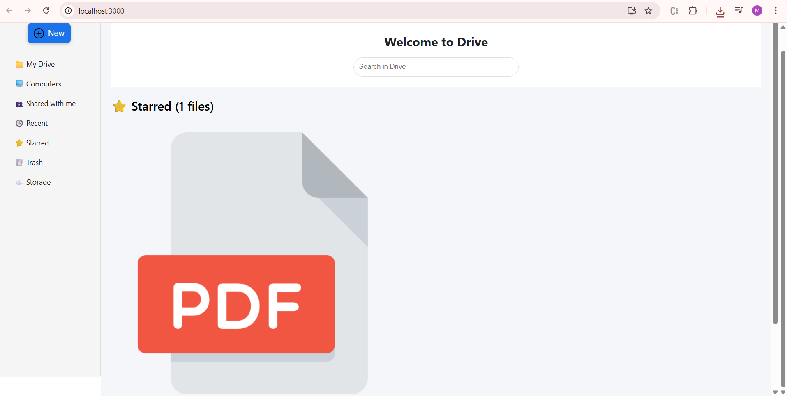

# 📁 Google Drive Clone

A simple **Google Drive Clone** built with **Spring Boot** and **React**.

---

## 🚀 Features

- 📤 **Upload Files**
- ⭐ **Star & Unstar Files**
- 🗑️ **Trash Functionality**
- 🔍 **Search Files**
- ⬇️ **Download Files**

---

## ⚙️ Tech Stack

- **Backend:** Spring Boot (Java)
- **Frontend:** React.js
- **Database:** MySQL
- **API:** RESTful (Axios)

---

## 🚀 Quick Setup

### 1️⃣ Clone Repository
```bash
git clone https://github.com/your-username/google-drive-clone.git
cd Drive
```

### 2️⃣ Database Configuration
Update `DRIVE-BE/src/main/resources/application.properties`:
```properties
spring.datasource.url=jdbc:mysql://localhost:3306/your_db_name
spring.datasource.username=your_db_username
spring.datasource.password=your_db_password
```

### 3️⃣ Prerequisites
- Java 17+
- Maven 3.6+ (or use included wrapper)
- Node.js 16+
- MySQL 8.0+

### 4️⃣ Run Backend (Spring Boot)
```bash
cd DRIVE-BE
./mvnw spring-boot:run        # Mac/Linux
mvnw.cmd spring-boot:run      # Windows
```
Backend runs on: `http://localhost:8080`

### 5️⃣ Run Frontend (React)
```bash
cd DRIVE-FE
npm install
npm start
```
Frontend runs on: `http://localhost:3000`

---

## 📂 Project Structure

```
Drive/
├── DRIVE-BE/                 # Spring Boot Backend
│   ├── src/
│   │   ├── main/
│   │   │   ├── java/
│   │   │   └── resources/
│   │   │       └── application.properties
│   └── pom.xml
└── DRIVE-FE/                 # React Frontend
    ├── src/
    ├── public/
    ├── package.json
    └── package-lock.json
```

---

## 📸 Screenshots

### ⭐ Starred & Search Functionality
Search files by name and star your important files.
  


---

### 🗑️ Trash Functionality
Move files to Trash and manage deleted items.


---

### 📤 Upload Functionality
Upload files with a click or drag-and-drop.


---

---

---

Made with ❤️ by **Manav Dave**

